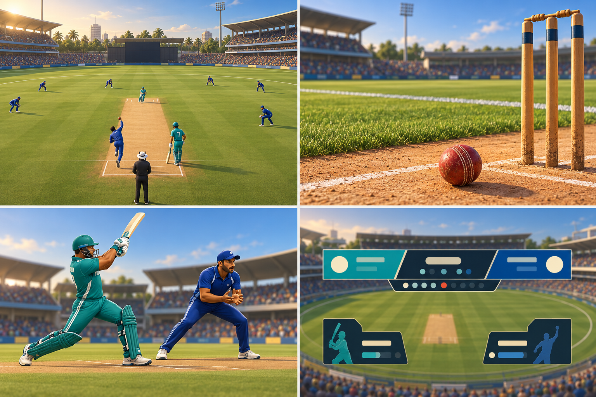

# Super Cricket short-match brief

**Status:** working target, revisited 6 October 2026 after the one-over slice.

## Player experience

Super Cricket is an offline, single-player cricket game about reading a delivery, choosing a shot, and seeing a clear result. The current practice mode is one over. The first release target is a short limited-overs exhibition between two fictional teams, with two innings, a target chase, and a compact overs selector. Keep one-over practice as the training mode. One stadium is enough for the first release; multiplayer and career play stay deferred.

Batting begins with defence, drive, and loft. Players choose an intent before contact and learn timing from misses and impact quality. Q/E footwork reaches the existing wide delivery. Preserve those timing and position differences in the ball result; keep any future assistance bounded, visible in the F1 view, and repeatable.

Bowling begins with authored run-up and release timing, then uses saved pace, wide, and no-ball presets. The short match can add opponent bowling changes after the player loop is readable. Use one fixed rules and physics baseline first; difficulty should tune opponent decisions and reaction time before it changes contact or scoring rules.

Fielding should explain outcomes through visible movement, catches, pickups, throws, and wicket events. Keep the current one-over rules loop as the test bed while simplifying heuristics are replaced by measured scenarios.

## Camera and presentation

Use the broadcast camera as the default: show the striker, bowler, pitch, field shape, and enough outfield to read the shot. Offer behind-striker, bowler-end, and square-leg views for practice and inspection. The ball, boundary, trajectory, score, and dismissal should remain easy to find during play. Build toward a readable stylized presentation with clear player silhouettes, restrained crowd detail, warm daylight, soft ground contact, and differentiated grass and clay. Cricket 07 is a long-term ambition, not a short-match art acceptance gate.

The current playable input is keyboard and mouse. Keep those controls complete; add a mapped controller for the short-match release. Do not build a second in-game authoring lab: use the validated CLI tools for delivery, batting, and field analysis.

Difficulty for the first public slice should have an approachable starting setting and a standard setting. Keep physical rules fixed across settings. Add harder opponent decisions only when the baseline match is repeatable and human playtests identify specific pressure points.

## Visual reference

This original AI-generated board is a direction reference, not shipped game art. It depicts fictional teams and a fictional ground. The four panels guide broadcast composition, clay and grass separation, readable animation silhouettes, and score hierarchy. Keep the runtime art stylized and practical for Blender-authored assets.

## Hardware and performance baseline

The named development floor and current renderer measurements are in [hardware-baseline.md](hardware-baseline.md). Use the same 1440 x 900 renderer resolution and 60 Hz VSync profile for comparison until a different release target is selected. The first sample establishes a baseline; it does not pass the later full-over CPU/GPU gate.

## Acceptance checkpoints

- A clean Windows checkout builds and opens the same two validated animated player assets without manual export repair.
- A representative full over keeps the ball, players, and score readable from the broadcast camera.
- Bat timing and footwork produce understandable differences across all three shots, including wide deliveries.
- Two innings finish with a stable result screen and no debug intervention.
- The agreed hardware target holds the measured frame-time budget in a representative full match; verify GPU time with a GPU profiler.

